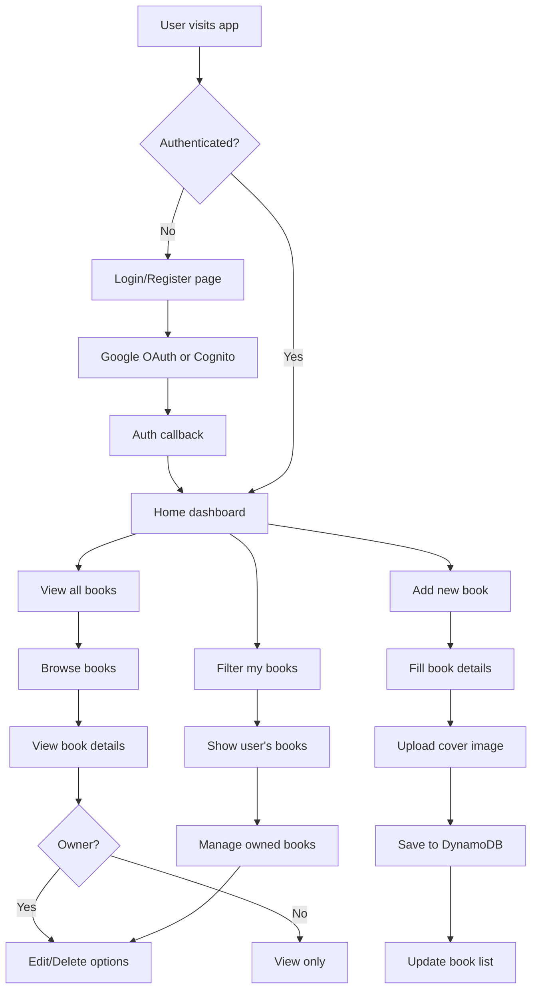

# BookClub - Serverless Book Sharing Platform

A modern, serverless book club application where users can upload books they own and share them with others. Built with AWS Lambda, API Gateway, DynamoDB, S3, and Cognito for zero ongoing costs when not in use.

## 📁 Project Structure & Documentation

We have organized the project for better maintainability. All documentation can be found in the [docs/](./docs/) directory.

- **[Project Setup](./docs/dev-setup.md)** - Detailed guide for local development and AWS setup.
- **[Requirements](./docs/requirements/)** - Business and technical requirements (e.g., [Lost & Found](./docs/requirements/lost-found.md)).
- **[Solutions](./docs/solutions/)** - Technical solutions and implementation details for various features.
- **[Testing](./docs/testing/testing.md)** - Guide to testing the application and [optimizations](./docs/testing/testing-optimization.md).
- **[Archive](./docs/archive/)** - Historic documentation and original project plans.

## Technologies Used

This project leverages a modern, cloud-native technology stack:

### Frontend (TypeScript)
- **React 19** with TypeScript for type-safe component development
- **Tailwind CSS** for responsive, utility-first styling
- **React Router DOM** for client-side routing and navigation
- **Axios** for HTTP API communication
- **Headless UI & Heroicons** for accessible, customizable UI components

### Backend (JavaScript)
- **AWS Lambda** functions with Node.js runtime for serverless compute
- **Serverless Framework** for infrastructure deployment and management
- **AWS SDK** for seamless integration with AWS services
- **UUID** library for unique identifier generation

### Infrastructure as Code (HCL)
- **Terraform** for managing AWS infrastructure resources
- **AWS API Gateway** custom domain configuration
- **Route 53** DNS management and SSL certificates
- **S3** and **DynamoDB** resource provisioning

## User Flow Diagram



## Setup Instructions

### Prerequisites

- Node.js 18+ installed
- AWS CLI configured with appropriate permissions
- Serverless Framework CLI (`npm install -g serverless`)

### Backend Setup

1. Navigate to the backend directory:
   ```bash
   cd backend
   ```

2. Install dependencies:
   ```bash
   npm install
   ```

3. Deploy to AWS:
   ```bash
   serverless deploy
   ```

4. Note the API URL from the deployment output.

### Frontend Setup

1. Navigate to the frontend directory:
   ```bash
   cd frontend
   ```

2. Install dependencies:
   ```bash
   npm install
   ```

3. Create a `.env` file with your API URL:
   ```bash
   cp .env.example .env
   ```
   
4. Update the `.env` file with your actual API Gateway URL from the backend deployment.

5. Start the development server:
   ```bash
   npm start
   ```

## Local Development

### Prerequisites

- Node.js 18+
- npm

No AWS credentials or deployed infrastructure are needed to run locally. Auth is bypassed and data is stored on disk.

### 1 — Install dependencies

```bash
cd backend && npm install
cd ../frontend && npm install
```

### 2 — Start the backend (port 4000)

```bash
cd backend
npm run dev
```

### 3 — Start the frontend (port 3000)

```bash
cd frontend
npm start
```

Open `http://localhost:3000` in your browser.

### Local data

Book and user data is persisted in `backend/.local-storage/`. Delete this directory to reset to a clean state.

To seed initial data:

```bash
cd backend
npm run dev:seed   # seeds data then starts the server
```

## Deployment

The application is designed to be completely serverless with zero ongoing costs when not in use. Use the automated deployment script:

```bash
./deploy.sh
```

## License

This project is licensed under the ISC License.